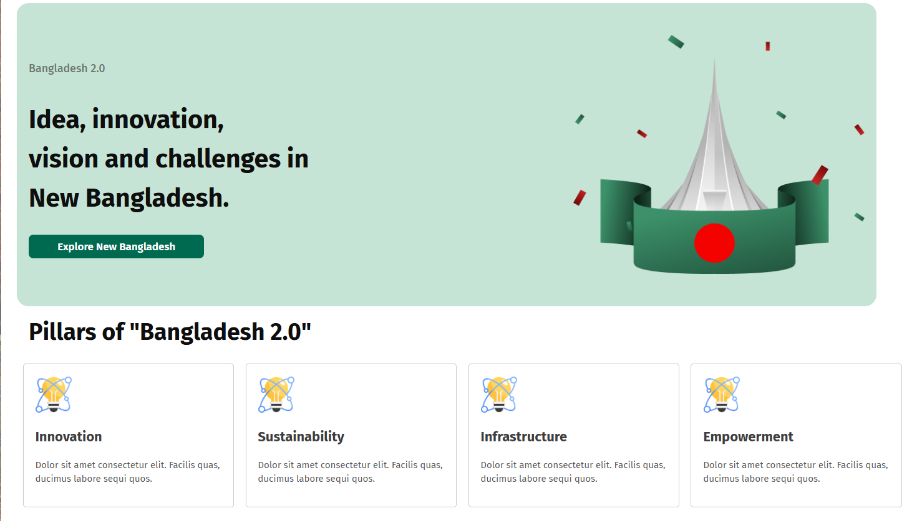
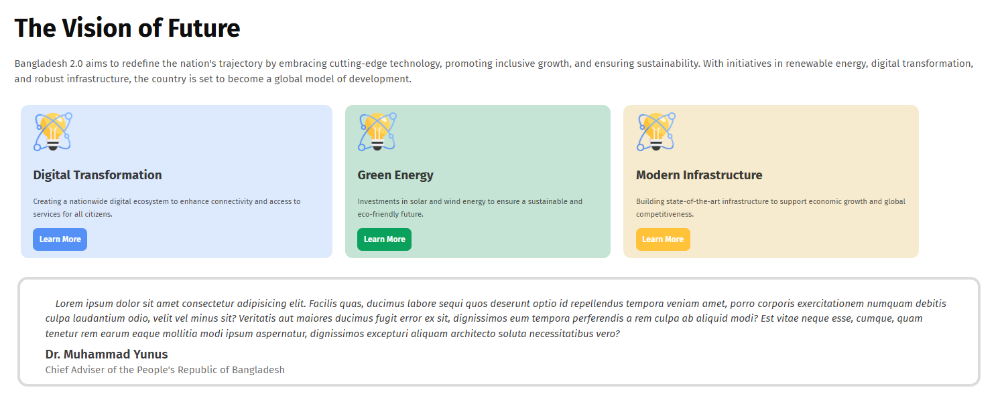
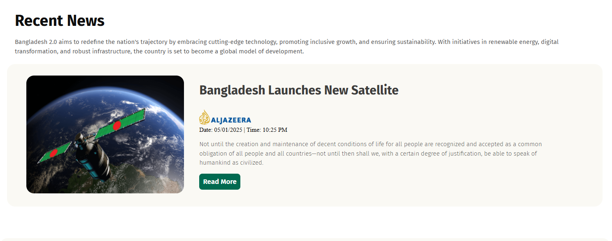
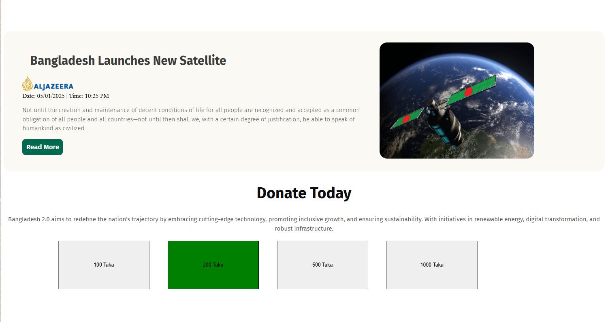
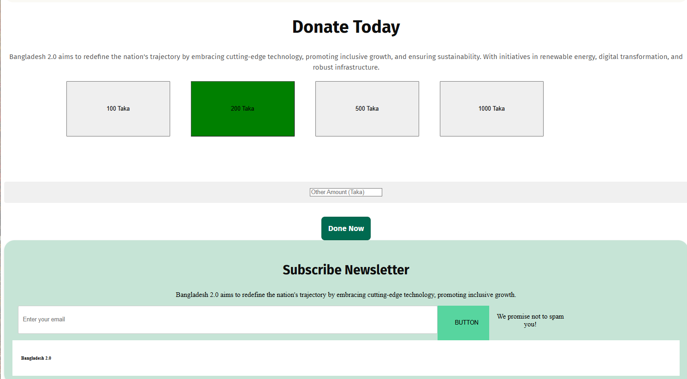

# Bangladesh 2.0 Landing Page

A modern and responsive landing page showcasing the vision of a future Bangladesh — focused on innovation, sustainability, and digital transformation.

## 🚀 Live Preview  https://israt-tarifa.github.io/Bangladesh-2.0/

---

## ✨ Features

- 🎯 Clean and modern UI design
- 📱 Fully responsive layout
- 💡 Vision & mission based sections
- 🧩 Reusable card components
- 📰 Recent news section
- 💰 Donation system UI
- 📩 Newsletter subscription section

---

## 🛠️ Technologies Used

- HTML5  
- CSS3  

## 📸 Screenshots

### 🏠 Homepage

### 🌟 Vision Section

### 📰 Recent News

### 🗞️ News Section

### 💰 Donation Section

